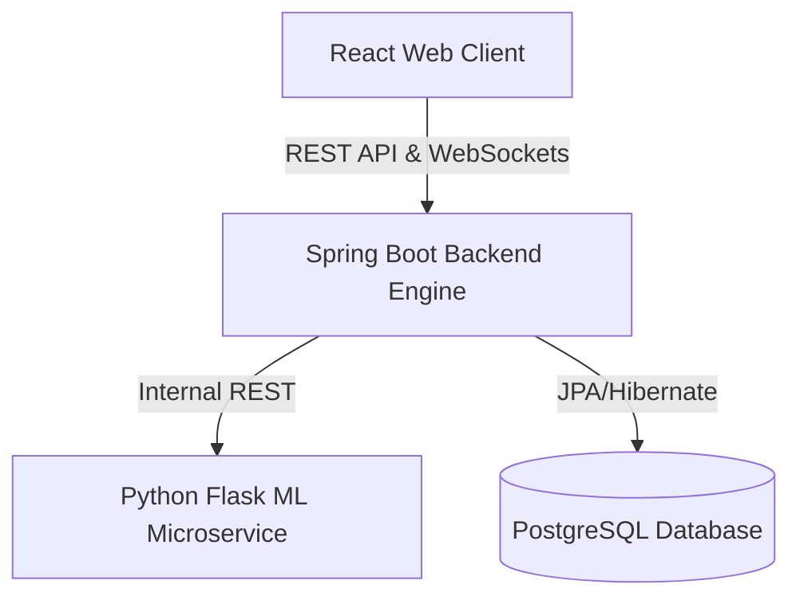

# ScheduleIQ 🚀
### AI-Powered Workforce Orchestration Platform

**ScheduleIQ** is an intelligent, full-stack workforce management platform designed to solve the complex problem of employee scheduling in high-turnover, variable-demand industries like retail, logistics, and hospitality. 

By combining constraint-based optimization, a dedicated Python ML service, and a mobile-first peer-to-peer swap marketplace, ScheduleIQ streamlines shift scheduling, minimizes labor budget overruns, and mitigates the risk of employee no-shows.

---

## 💡 The Problem & The Solution

### The Challenge
In shift-based workplaces, managers spend hours each week manually building rosters on spreadsheets. This leads to:
* ⚠️ **Budget Overruns:** Accidentally scheduling employees for overtime.
* ⚠️ **Understaffing / Coverage Gaps:** Misaligning staff count with daily store traffic/monsoons/holidays.
* ⚠️ **No-Show Chaos:** Employees missing shifts without notice, leaving the business short-staffed.
* ⚠️ **Shift Swap Friction:** Manual coordination via group chats that causes coverage imbalances.

### The ScheduleIQ Solution
1. **Constraint-Based Auto-Scheduler:** A smart algorithm generates optimal schedules in seconds, mathematically guaranteeing budget compliance and respecting employee preferences.
2. **Predictive Risk Engine:** A Python machine learning microservice analyzes employee attendance history to predict "No-Show Risks" *before* shifts occur.
3. **Smart Shift Swap Marketplace:** A peer-to-peer marketplace where employees trade shifts. The system automatically audits trades and alerts managers of potential labor rule violations or high no-show risks.

---

## 🛠️ Architecture & Tech Stack

ScheduleIQ features a decoupled, production-ready microservices architecture:

### Frontend
* **React 18** (Vite SPA)
* **CSS3 & TailwindCSS** (Vibrant styling, dark modes, dynamic transitions)
* **WebSockets** (Real-time notifications)

### Core Backend
* **Java 21 & Spring Boot 3**
* **Spring Security & OAuth2** (JWT Stateless Session Management & Google Sign-In)
* **Spring Data JPA & Hibernate**

### ML & Optimization Service
* **Python 3.10 & Flask** (Predictive analytics endpoints)
* **Docker & Docker Compose** (Containerized build pipeline)

### Database
* **PostgreSQL** (ACID transactional integrity, normalized relations)

---

## ✨ Key Features Showcase

### 👔 Manager Dashboard
* **Dynamic Analytics:** Real-time visibility into weekly labor hours, projected salary costs, and understaffing alerts.
* **Auto-Scheduler Engine:** Generates a weekly schedule automatically, factoring in employee availabilities, roles, and budget limits.
* **Demand Forecast Visualizer:** Beautiful charts mapping historic customer footfall, weather conditions, and seasonal surges.

### 👤 Employee Portal
* **Mobile-First Shift Viewer:** Clean interface for employees to view scheduled shifts, hourly rates, and earnings.
* **Availability Preferences:** Easy-to-use scheduler for setting weekly shift preferences.
* **Shift Swapping Marketplace:** Submit swap requests to peers, monitor real-time swap requests, and coordinate schedule adjustments instantly.

---

## 📈 System Design Highlights

* **Decoupled Business & Data Science Logic:** Decoupled ML capabilities from the core Java backend to prevent resource starvation during complex ML predictions.
* **Secure JWT Session Management:** Implemented custom stateless JWT filters alongside Google OAuth2 integration for passwordless authentication.
* **Cascading Transaction Security:** Configured JPA mappings with precise lifecycle rules to protect data integrity during multi-step shift trades.
